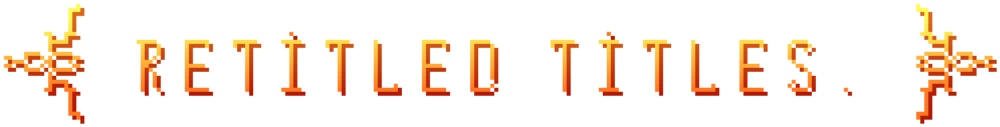

## What is this, and what does it do?

This is a shader for Minecraft 1.21.4 (soon™ will be updated to higher versions, feel free to fork this repo), combined with specially created font textures (I included instructions on how to make them in the [how to make a texture](./how_to_make_a_texture.md)), that allows to create title texts with more complex animations than just vanilla alpha linear fade-in and fade-out, and in fact, when using this pack and appropriate text colors for shader to pick up on, the characters don't get more opaque as the title appears, but rather more and more pixels starting to get visible (included a small showcase below).

It relies on the titles first increasing in alpha as they fade-in, and then decreasing as they fade-out, in other words:
1. Transition times of the titles are derived from the `fade-in` and `fade-out` times in the `/title <selector> times <fade-in> <stay> <fade-out>` command.
2. The fade-out animation is _always_ the fade-in animation played in reverse. 
  _Note: you could achive different fade in and out animations if you will chain 4 title commands together:  
  `title <selector> times <fade-in> 60s 0t`;  
  `title <selector> title <text with configured fade-in transition>`;  
  then after "fade-in" time + any amount of "stay" time (as long as it's shorter than 60s) you use  
  `title <selector> times 0t 0t <fade-out>`;  
  `title <selector> title <text with configured fade-out transition>`  
  it will create a seamless transition between two._

 
<video controls>
<source src="showcase/pixel_appearing_showcase.mp4" type="video/mp4">
Your browser does not support the video tag.
</video>

## How to use this tool

### Text color

Different channels of text color carry different information for the shader to read, you will need to understand what corresponds to what before doing any sort of customization:
> **Red:**  
  Stores transition/animation ID, aka what would be used to move the text around throughout transition.

> **Green:**  
  It does a few things; first it should be in range from 0x82 to 0x8C for the shader to even trigger, and then it determines either the scaler of the text (if it's value is `0x87` and higher), as vanilla titles are quite big and you can't fit much text in there. 0x87 corresponds to the scale of 1.0, aka the one of vanilla; 0x88 corresponds to 0.5, which in examples is mostly used for the `fancy` font, as otherwise barely anything fits on the screen at all; 0x89 corresponds to 1/3, 0x8A to 1/4 and so on.
  But, if it's value is `0x86` or lower, it will place the text on different positions & anchors instead places the text :
  `0x86`: in the actionbar  
  `0x84`: on the top of the screen  
  `0x83`: in the top right corner  
  More might added in the future.

> **Blue:**  
  Stores gradient ID that will be applied to the text; new custom gradients could be easilly added, following the instructions on [how to make a custom gradient](./how_to_make_a_gradient.md)

_Note: you can also apply the same things to the shadow of the text if you will get the HEX color, prepend to it FF to set the alpha to 255, and convert to decimal, so it can be used as `shadow_color`_.

### Text fonts

There are 3 pre-made fonts that come with this tool:
1. `retitled_titles:default`.  
Is the ASCII part of the `minecraft:default` font, that was made to work with the pack.  

2. `retitled_titles:fancy`.  
Is a completely custom asset made specifically for this pack and feel free to use it in your projects alongside this tool, or without if you will credit me and this pack.  
Is natutally bigger than vanilla text, so scaler of 0.5 or lower is highly recommended. (aka when green channel is `0x88` or higher)  
Lowercase letters and numbers use 2-color gradients, while uppercase use 3-color gradients.  
Contains 6 "decorators", basically characters to put on each side of a title to make it look even fancier:  
`decor.0` (`\u0001`&`\u0002`) (2-color gradient),  
`decor.1` (`\u0003`&`\u0004`) (two 2-color gradients),  
`decor.2` (`\u0005`&`\u0006`) (I don't remember tbh),  
`decor.3` (`\u0007`&`\u0008`) (two 2-color gradients),  
`decor.4` (`\u0009`&`\u000A`) (3-color gradient),  
`decor.5` (`\u000B`&`\u000C`) (2-color gradient).  

3. `retitled_titles:fancy_more_colors`.  
Is a copy of the `retitled_titles:fancy`, except lowercase letters, numbers, and `decor.5` use a 4-color gradient.

## Examples

### Red

Lets say, we want a title that gently pops from down and slightly overshoots before getting back, therefore we would use animation `0x25`, which is exactly what we want (what ID corresponds to what animation could be looked up and changed [here](assets\retitled_titles\shaders\include\configured_transitions.glsl)), thus our red channel would be `0x25`.

### Green

Then, as we would use the `fancy` font because I said so, we would scale down the text by a factor of 2, aka we would use `0x88` for the green channel to do exactly that.

### Blue

Afterwards, if we would like for the text to be yellow/golden, and have a shadow of a matching color, we would use colors `0x00` and `0x0A` accordingly. (`0x00` is yellow and `0x0A` is red/orange-ish)

### Alpha

But, remember, the shadow is in `ARGB` format and not simply `RGB` like the text itself, so we would also have `0xFF` as out alpha channel.

### Text contents

For the text lets be absolutely unbiased and pick "retitled titles." alongside with `decor.0`, aka the final string would be `"\u0001 retitled titles.  \u0002"` (note the double spaces, idk what did I do wrong with the font but we need those)

### Combining

So, here we have it:  
Text color is `#258800` (all previosuly brought up `25`, `88`, `00` but without the `0x` part as obviously HEX codes are written in HEX and there is no need to indicate it any further), and Text shadow color is `0xFF25880A`, but we need to convert it to decimal so it's just `4280649738`, same thing but written differently.  
The font is `retitled_titles:fancy` because yes, and text is `"\u0001 retitled titles.  \u0002"` how was mentioned previously.

Putting it all together we have the thing from the logo:  
`title @a title {"text": "\u0001 retitled titles.  \u0002", "color": "#258800", "font": "retitled_titles:fancy", "shadow_color": 4280649738}`, Which in-game looks like this:

 
<video controls>
<source src="showcase/logo.mp4" type="video/mp4">
Your browser does not support the video tag.
</video>

#### Commands to try in-game:

I configured my `title times` with just `title @s times 10t 10t 20t` 

**(The cyan `showcase` title from the "pixel appearing showcase")**  
`title @p title {"text": "\u0003 showcase\u0020 \u0004", "color": "#FF8801", "font": "retitled_titles:fancy", "shadow_color": 0}`

**("you can chain them together" titles)**  
`title @p title {"text": "\u000B you can\u0020 \u000C", "color": "#268808", "font": "retitled_titles:fancy_more_colors", "shadow_color": 0}`  
_(wait 20 ticks)_  
`title @p title {"text": "\u000B chain them together\u0020 \u000C", "color": "#29880F", "font": "retitled_titles:fancy_more_colors", "shadow_color": 0}`

**("make them slide" title)**  
`title @p times 10t 60s 0t`  
`title @p title {"text": "\u000B make them slide\u0020 \u000C", "color": "#298819", "font": "retitled_titles:fancy_more_colors", "shadow_color": 0}`  
_(wait 16 ticks)_  
`title @p times 0t 0t 10t`  
`title @p title {"text": "\u000B make them slide\u0020 \u000C", "color": "#268819", "font": "retitled_titles:fancy_more_colors", "shadow_color": 0}`

